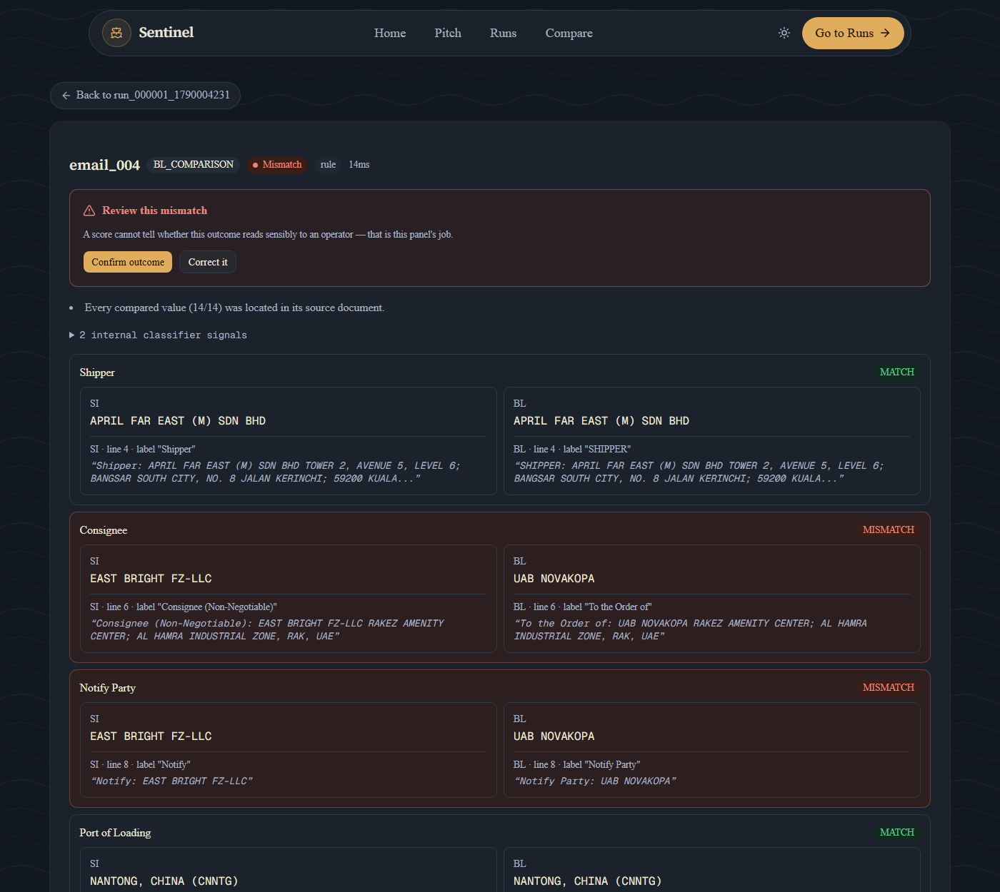
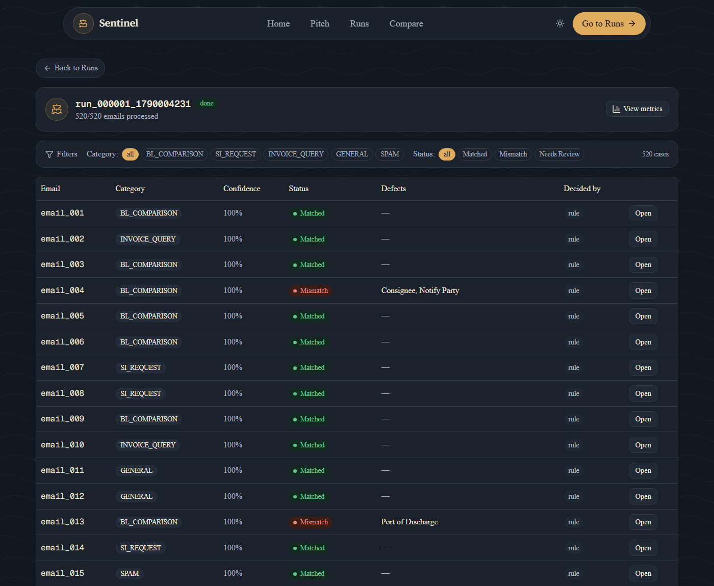

# Sentinel — shipping document verification

[](https://github.com/TCF1209/duocode-sentinel/actions/workflows/ci.yml)

> **Every answer comes with its evidence.**

*From email inbox to discrepancy report.*
Built by **DuoCode** for the Averis × Monash Hackathon 2026. DuoCode also
builds [**Agenticcs**](https://agenticcs.net), an auditable AI
customer-service platform — the same evidence-first discipline shows up in
both, independently.

> ### ▶ [duocode-sentinel.vercel.app](https://duocode-sentinel.vercel.app)
>
> The dashboard. Press **Start a run** to process the bundled demo inbox, then
> open a `MISMATCH` case to see the two documents side by side with the line
> each value was read from. **Compare (demo)** takes two files of your own.
>
> API: [sdoc-sentinel-api.onrender.com](https://sdoc-sentinel-api.onrender.com)
> — `GET /` reports `ready: true` once it has a completed run.
>
> On a free tier the container sleeps after about 15 minutes, so **the first
> request after a quiet spell takes 30–60 seconds** while it wakes. It runs the
> demo inbox at boot, so you arrive at a finished run rather than an empty
> screen. Both are deployed from this repository by the committed
> `render.yaml` and `web/vercel.json`; the runbook is
> [`docs/DEPLOY.md`](docs/DEPLOY.md).



*One case out of 520. `Consignee` and `Notify Party` disagree — and under every
value, matched or not, is the document it came from, the line number, the label
as it was printed there, and the raw text. The line above the fields is the
evidence gate reporting that all 14 compared values were located in their
source; had one of them not been, this case would have gone to a person instead
of being reported as a discrepancy.*

| | |
|---|---|
| **Accuracy** | **1.0000** final score on the dev set **and** on three held-out draws, generated from the organisers' own generator with seeds we never developed against — 225 planted defects, every one caught with the **exact** field set, no false alarms, all 80 escalations correct. Not four *independent* tests, and `docs/SCORING.md` §4.1 says why. |
| **Tests** | **646** — fifty added on 25 Sep: forty-five for the reply drafts' wording pass (`backend/tests/test_reply_polish.py`), four for the in-place review and its value corrections and one for telling a scanned PDF from a corrupt one (`backend/tests/test_api.py`), on top of the 596 of 24 Sep; re-run 25 Sep on a checkout with no `data/bundle` as **504 passed, 142 skipped, 0 failed, 0 xfailed**. The one strict `xfail` that used to sit here is gone: it pinned a defect found by review, `docs/ADVERSARIAL.md` §5.4, fixed the same day it was found. The same command runs on every push in [CI](.github/workflows/ci.yml). |
| **Speed** | **~3 ms per email**, single-threaded on a laptop: 520 emails end to end in about 1.5 s. |
| **Cost** | **100% of decisions are made by rules.** `decided_by` is `"rule"` for all 520 emails; no model call decides anything on the graded inbox. |

Every number above was re-measured on the current commit before this file was
written — the commands are in [Verify it yourself](#verify-it-yourself).

The accuracy row is the only one a reader cannot reproduce without the
organisers' dataset, so here is its provenance instead of asking for trust. It
was measured at `4c852a7`. **Six** commits since have touched `backend/sdoc/`
— the pipeline the score is a function of — and the run it produces today is
**byte-identical** to the one measured then, `submission.json` at md5
`1c08cd21`. Run the command, count the commits, re-run the pipeline and
compare the hashes; the paragraph is checkable rather than asking for trust:

```bash
git log --oneline 4c852a7..HEAD -- backend/sdoc/
```

Three of the six change what is *reported* and cannot reach the scorer at all:
the vision transcript is attached to `to_report()` only, the sender likewise,
and the evidence gate's new sentence names which label was not recognised
instead of saying the documents do not state it — a better message for the
same escalation. The other three change reading or comparison, and each was
found by testing against a real document from *outside* the organisers'
generator ([`docs/EXTERNAL_VALIDATION.md`](docs/EXTERNAL_VALIDATION.md)):

| Commit | What, and why it cannot have moved the score |
|---|---|
| `labels.py` | Ignores one more reference-number label. The string it ignores appears in zero of the 520 graded documents (`grep`, checked). |
| `readers/office.py` | Reads a container-manifest table shape none of the 8 real `.docx` attachments in the graded set has (checked directly). |
| `compare.py` | Anchors a repair on its evidence locator instead of the first text match. The bug this closes had already been measured firing on **zero** of the real documents, and still does after the fix. |

Each one was re-verified the same way: `backend/tools/adversarial.py` against
the committed `bundle_data/` — the same 520-email set the score is measured
on, no answer key required — reports all 16 perturbation modes
**byte-identical** to the run before that commit. Full detail, commit by
commit: `docs/STATUS.md`'s 2026-09-24 entry.

What this page cannot do is re-run the organisers' own scorer here — 
`data/_grader/` is git-ignored and was not on the machine that made these
three commits. The claim above is therefore evidence of the same *kind* as
the original one, not a rerun of it: measured, not assumed, and the harness
above is what a judge can run to check it independently.

What those numbers do **not** prove is in
[What the evidence shows](#what-the-evidence-shows-and-what-it-does-not), and
what breaks the system is measured in
[`docs/ADVERSARIAL.md`](docs/ADVERSARIAL.md).

### This page is the project documentation

It is the submission's *Slide Deck / Documentation* link, so the four things
that brief asks for are listed here with the section that answers each:

| | Section |
|---|---|
| **Technical architecture** | [Technical architecture](#technical-architecture) — the six stages and what each decides, then [`docs/ARCHITECTURE.md`](docs/ARCHITECTURE.md) for the design reasoning and [`docs/DECISIONS.md`](docs/DECISIONS.md) for the alternatives we rejected |
| **Implementation details** | [Implementation details](#implementation-details) — what was built around the six stages, the 11 API routes and the 7 dashboard routes. Then [Quick start](#quick-start) to run it, [Repository map](#repository-map) for where each file lives, and [Verify it yourself](#verify-it-yourself) for the commands behind every number above |
| **Challenges faced** | [Challenges faced](#challenges-faced) — five defects found by measurement, what each cost, and the one still open |
| **Future roadmap** | [Future roadmap](#future-roadmap) — five items in build order, and the one thing we would deliberately not do |

### Two sections that argue against this page

The brief asks for neither. They are the two we would open first if we were
marking this, because they are where a submission usually stops being honest.

- [**What the evidence shows, and what it does
  not**](#what-the-evidence-shows-and-what-it-does-not) — 1.0000 on four
  datasets is evidence about *one generator*, and this page says so before a
  judge has to ask. Then the harness we built to break ourselves: 16
  perturbation modes over 3,008 perturbed documents and 20,496 field reads,
  with **no answer key** — the unperturbed reading is the reference — and the
  one row that still bends, reported as it came out.
- [**Where the data comes from**](#where-the-data-comes-from) — the organisers'
  package reached us containing the answer key and the dataset generator, which
  their own README says it should not have. What we did with each, and the one
  command that checks it: `grep -rn ground_truth backend/ --include=*.py`
  returns nothing.

---

## The problem

A shipping operations team receives everything in one inbox: requests to check
documents, requests for new shipping instructions, invoice queries,
operational noise, and spam. For a document check they compare a **Shipping
Instruction (SI)** against a **draft Bill of Lading (BL)** across seven fields
and look for anything that does not match, before the draft is finalised.

Sentinel does that work, and — this is the part that matters in an operations
setting — it knows when it cannot. A missing attachment, an unreadable scan, a
blank field or the wrong document type produces a case for a human with the
reason and the source evidence attached, not a confident guess.

| Capability | How |
|---|---|
| **Classify** | Scored rule classifier over 5 categories; an LLM decides only the ambiguous tail. Each email records whether a rule or the model answered. |
| **Extract** | Format-aware readers for `.txt`, `.pdf`, `.docx`, `.xlsx`. PDFs are reconstructed from word coordinates, not flat text. Every value keeps a pointer back to where it was read. |
| **Compare** | Labels are matched by meaning (`Load Port` = `Port of Loading`); values are canonicalised and compared exactly. Side-by-side SI/BL output with the differing fields flagged. |
| **Ask for help** | Missing attachment · wrong document type · unreadable file · blank required value → routed to a review queue with the evidence, for a person to confirm or correct. |

### Technical architecture

Six stages, in one direction, with no web framework or database anywhere in the
core — `backend/sdoc/` is a library the CLI and the API both call, so the thing
that is scored and the thing that is demonstrated are the same code.

| # | Stage | Module | What it decides |
|---:|---|---|---|
| 1 | Classify | `classify/rules.py`, `classify/llm.py` | which of the 5 categories; the model is asked only when the rule score is ambiguous |
| 2 | Intake | `readers/`, `doctype.py` | can each attachment be read at all, and is it the document it claims to be |
| 3 | Extract | `labels.py`, `extract/fields.py`, `extract/llm.py` | the 7 field values, each carrying `Evidence(doc, locator, label, snippet)` |
| 4 | Compare | `normalize.py`, `compare.py` | per field: MATCH, MISMATCH, or UNCOMPARABLE |
| 5 | **Evidence gate** | `evidence_gate.py` | **may this outcome be reported as fact at all** — a veto stage, not a step |
| 6 | Decide | `pipeline.py` | `OK` / `MISMATCH` / `NEEDS_REVIEW`, with the reason and the recovery action |

Stage 5 is the one that is unusual and the one the design rests on. It runs
*after* the comparison and can overrule it: a value we cannot re-locate in its
source, a blank treated as a difference, a pair that is not an SI and a BL, two
readings that differ only in characters OCR confuses — each becomes an
escalation carrying both readings, rather than an answer. `docs/ADVERSARIAL.md`
§6 measures what that costs and what it buys.

Around the core: **FastAPI** (11 routes over the same pipeline, deployed as a
container on Render) and a **Next.js 16** dashboard on Vercel. The design and
the reasoning behind each choice is in
[`docs/ARCHITECTURE.md`](docs/ARCHITECTURE.md); the alternatives we rejected,
and why, are in [`docs/DECISIONS.md`](docs/DECISIONS.md).

---

## Implementation details

The architecture above is the six stages. This is what was actually built
around them, and where each part lives. Running any of it is
[Quick start](#quick-start); the directory listing is the
[repository map](#repository-map).

**The pipeline — `backend/sdoc/`.** A library with no web, database or network
imports, so `backend/run.py` and the API execute identical code and the thing
that is scored is the thing that is demonstrated. `readers/` dispatches by
format (`rows.py`, `plain.py`, `office.py`, `pdf.py`, `scan.py`, and
`fallback.py` for anything with no precise reader); `labels.py` resolves a
printed label to one of the seven fields in three passes; `normalize.py`
canonicalises companies, ports and quantities; `compare.py` decides each
field; `evidence_gate.py` may overrule it; `pipeline.py` assembles the case.

**The model tier — `llm/`, `classify/llm.py`, `extract/llm.py`,
`readers/scan.py`.** Structured outputs, a content-hash cache so repeated runs
are reproducible and not re-billed, per-purpose token metering and a run
budget. Every path is optional: with no `OPENAI_API_KEY` the pipeline still
runs end to end and escalates what it cannot read (`CLAUDE.md` rule 5).

**The API — `backend/api/`, FastAPI, 15 routes.** Pydantic models at the
boundary only; `store.py` isolates state so the in-memory store is one file to
replace, not a rewrite of the routes.

| | |
|---|---|
| `GET /` | readiness, data root, whether model runs are permitted, whether a model is configured at all |
| `POST /runs` · `GET /runs` · `GET /runs/{id}` | start a run over the bundled inbox; list; status and `metrics.json` |
| `GET /runs/{id}/cases` | case list, filterable by category, status and `decided_by` |
| `GET /cases/{id}` | one full report — seven fields, both sides, every piece of evidence |
| `GET /cases/{id}/attachments/{side}` | the SI or BL file itself, inline — the whole document behind the evidence snippet |
| `POST /cases/{id}/review` | a reviewer confirms or corrects; the report updates |
| `POST /cases/{id}/retry` | re-process one email in place, re-reading it from disk |
| `POST /cases/{id}/recheck` | **re-sent documents**: the same check run again on an uploaded SI and/or BL; the answer it replaces, and any review of it, stay readable in the case's history |
| `POST /compare` | **upload two documents of your own** and get the same report |
| `POST /reply-drafts/polish` | reword a reply draft's greeting and closing; the facts and the request never reach the model ([`reply_polish.py`](backend/api/reply_polish.py)) |
| `GET /runs/{id}/patterns` | the inbox read sideways: which fields go wrong, and per-sender defect rates with 95% intervals |
| `GET /metrics` · `GET /submission` | operational counters; the graded artefact |

**The dashboard — `web/`, Next.js 16 App Router, 7 routes.** `/` · `/runs` ·
`/runs/[runId]` · `/runs/[runId]/cases/[emailId]` — the side-by-side report
with the source line under every value, which is the screen the project exists
to produce · `/runs/[runId]/metrics` · `/compare` · `/pitch`.



*`/runs/[runId]` on the deployed demo. Every row records which tier answered —
`decided_by` is `rule` for all 520 on this inbox, which is the cost argument in
[§2.1 of the architecture](docs/ARCHITECTURE.md) made visible rather than
claimed.*

**Deployment.** Committed, not clicked into a dashboard: the root `Dockerfile`
and `render.yaml` build the API, `web/vercel.json` the frontend. Runbook and
the failures worth predicting: [`docs/DEPLOY.md`](docs/DEPLOY.md).

**Tests — 596**, up from 574 at `4c852a7` (twenty-two new, one former `xfail` now
a plain pass — see the table two sections up). The skips are guarded in
`conftest.py` and print their reason rather than failing on an empty read —
exact counts and the caveat on which of them are freshly re-run versus
carried over from before `4c852a7` are in [The test
suite](#the-test-suite).

---

## Quick start

Re-verified on a fresh clone on 21 Sep 2026 — every command below was run
against a clone holding no `data/`, no API key and no network access, on a
venv built from scratch. The dependency floors resolve to current releases
(`openai` 3.x against a `>=1.60` floor, `pytest` 9, `fastapi` 0.141,
`pydantic` 2.13) and the suite passes on them, so the pins are floors by
intent rather than by neglect.

```bash
git clone <repo-url> && cd sdoc-sentinel

python -m venv .venv
.venv/Scripts/python.exe -m pip install -r backend/requirements.txt   # Windows
# source .venv/bin/activate && pip install -r backend/requirements.txt  # macOS/Linux

# the 30-email demo inbox that ships with the repo — no download, no key, no network
.venv/Scripts/python.exe backend/run.py --data demo_data --out runs/demo
```

That prints the category counts, the outcomes, the escalation reasons and the
rule share, and writes three files under `runs/demo/`:

* `submission.json` — the shape the official self-evaluation expects
* `report.json` — the full audit trail: every field, both sides, every verdict,
  every piece of evidence, every gate decision and the recovery text a reviewer
  should act on
* `metrics.json` — counts, timings, rule share, and model cost per purpose

`demo_data/` is 30 emails and 31 attachments curated from the participant
bundle by `scripts/make_demo_data.py`: all five categories, all four escalation
reasons, and a real defect in each attachment format. It is deliberately **not**
representative — defects are over-sampled so a five-minute demo can show them,
so counting outcomes there says nothing about accuracy. The accuracy claim is
the 520-email one, below.

### The test suite

```bash
.venv/Scripts/python.exe -m pytest backend/tests
```

On a fresh clone at `4c852a7`: **431 passed, 142 skipped, 1 xfailed, 0
errors**. Re-run on 25 Sep on a checkout holding no `data/bundle` — the same
condition as a clone — the suite is **646 tests: 504 passed, 142 skipped, 0
failed, 0 xfailed**, read off pytest's own summary line rather than
remembered: seventy-two tests added since `4c852a7` (fifty of them on
25 Sep: forty-five for the reply drafts' wording pass, five for in-place
review, value corrections and scan state), and the former `xfail` now a
plain pass.
[`.github/workflows/ci.yml`](.github/workflows/ci.yml) runs this same command
on every push, on a machine nobody on the team configured — the fresh-clone
check made permanent rather than repeated by hand.

The skips are not a broken checkout. `data/` is git-ignored — it holds the
organisers' dataset and, beside it, their answer key (see
[Where the data comes from](#where-the-data-comes-from)) — so a clone has no
full bundle to read. `backend/tests/conftest.py` guards exactly the tests that
open it and skips them with the reason printed, rather than letting ~100 tests
fail on an empty read and read as a broken project. With the participant bundle
at `data/bundle/`, the same command gave **573 passed, 1 xfailed** at
`4c852a7`, and **641 passed, 0 xfailed** on 25 Sep.

### The full inbox

The 520-email bundle is not in the repository. Put it in place so that
`data/bundle/inbox/` and `data/bundle/attachments/` exist, then:

```bash
.venv/Scripts/python.exe backend/run.py --data data/bundle --out runs/latest
```

An optional API key switches on the model fallbacks — classification for
low-confidence emails, extraction for labels the rules do not recognise, and
reading scanned documents. **Without it the pipeline still runs end to end**:
rules handle everything they can and the rest is escalated rather than guessed.
That is a design rule, not a coincidence (`CLAUDE.md` rule 5).

```bash
cp .env.example .env     # then set OPENAI_API_KEY
```

### The API and the dashboard

```bash
# API — 11 routes over the same pipeline code the CLI uses
.venv/Scripts/python.exe -m uvicorn backend.api.main:app --reload --port 8000
#   SENTINEL_DATA_ROOT=<a bundle>    which inbox POST /runs processes
#                                    (defaults to data/bundle; demo_data works)
#   SENTINEL_CORS_ORIGINS=<origins>  defaults to *

# dashboard — talks to http://127.0.0.1:8000 unless told otherwise
cd web && npm ci && npm run dev
#   NEXT_PUBLIC_SENTINEL_API_URL=<api base>   to point at a deployed API
```

`npm run build` and `npx tsc --noEmit` are both clean on a fresh clone, **in
that order**: Next generates the route types into `.next/types`, so a
type-check run before any build fails on files that are perfectly correct.

`backend/api/store.py` keeps runs in one process's memory. Every restart —
including every redeploy — empties the run list, and the first thing to do
after one is start a run again.

### Verify it yourself

```bash
# the headline score: the pipeline, then the organisers' own scorer
.venv/Scripts/python.exe backend/run.py --data data/bundle --out runs/check
.venv/Scripts/python.exe data/_grader/score_cli.py runs/check/submission.json \
    --ground-truth data/_grader/ground_truth.json

# the same two steps in one command, plus the Markdown row for the score log
.venv/Scripts/python.exe scripts/evaluate.py
.venv/Scripts/python.exe scripts/evaluate.py --data data/holdout --out runs/holdout

# where the reader holds and where it breaks — no answer key involved.
# bundle_data/ is committed, so this one needs nothing you do not already have.
.venv/Scripts/python.exe backend/tools/adversarial.py --data bundle_data \
    --out runs/adversarial.json
```

**The last command is the one to run if you only run one.** It needs no
dataset download, no API key and no network: `bundle_data/` is the participant
bundle, committed — 520 emails and 251 attachments — and the harness has no
answer key by construction, because the reference is the unperturbed reading of
the same document. Re-run on this commit it reports 16 modes over **3,008
perturbed documents and 20,496 field reads**: thirteen modes at zero movement
including the `control_rewrite` sanity row, `ocr_confusions` at **0** silent
wrong values and **0** invented defects, unfamiliar wording escalating **168**
documents rather than guessing at them, and `wrapped_value` still carrying its
74 short reads and the **1** masked discrepancy that
[§5.2](docs/ADVERSARIAL.md) describes — `email_145`, unfixable by this
repair *by construction*, not the §5.4 defect that used to share this
number: that one was fixed 2026-09-24, fired on zero real documents before
the fix and still does after it. Those two are in the output on purpose. A
harness that only prints zeroes is not measuring anything.

One more thing a clone gets right now that it did not before 24 Sep:
`.gitattributes` declares every attachment format binary, so a Windows
checkout with `core.autocrlf` no longer rewrites a PDF's line endings. That
rewrite moved one file's `startxref` by 74 bytes and turned a real planted
defect (`email_499`, `gross_weight_kg`) into an unreadable attachment on that
platform only — 45 mismatches and 21 escalations instead of the 46 and 20
the same commit produces on Linux and on the deployed API. Found, explained
and fixed in `docs/STATUS.md`'s 2026-09-24 entry; the numbers on this page
were always the Linux ones.

---

## What the evidence shows, and what it does not

**It shows we are not memorising a draw.** Four datasets — the dev set (520
emails, 46 defects) and three held-out seeds never developed against (520 / 57
defects, 320 / 31, 820 / 91) — all score 1.0000 from the same commit, across a
different entity sample, a different defect draw, a different format mix and a
different scale. Table and method: [`docs/SCORING.md`](docs/SCORING.md) §4.1.

**It does not show robustness to real documents.** All four sets come from one
generator, so they share one label vocabulary, one set of renderers and one
entity pool. `docs/SCORING.md` §4.2 says so plainly and this page repeats it
rather than let a judge find it: real shipping documents bring label wording we
have never seen, layouts we have never parsed, and scans of varying quality. A
perfect score on four draws from one generator is evidence about the generator.

So the measurement that matters is the one that goes looking for the failure.
[`docs/ADVERSARIAL.md`](docs/ADVERSARIAL.md) perturbs the documents ourselves —
16 modes in 8 families, 3,008 perturbed documents and 20,496 field reads on the
dev set, then the whole thing again on a held-out seed — and asks whether a
document a human would still read identically is read identically by us. There
is no answer key in it: the unperturbed reading is the reference.

| | |
|---|---|
| **Holds** | Punctuation drift, case and spacing noise, reflowed values, indented labels, reordered fields — **zero** movement on both draws. The `control_rewrite` row is zero too, so the instrument itself is sound. |
| **Costs recall, safely** | Unfamiliar label wording loses 1,100 of 1,281 fields and escalates every one: zero false discrepancies, zero silent wrong values. The right failure direction, and useless to an operator — see the next section. |
| **Bends, safely** | OCR character confusion (`NANTONG` → `NANT0NG`) still moves 972 of 1,281 dev reads, and always will: the document genuinely says something else, and nothing separates "the scanner misread a digit" from "the document says that" from one source. What it no longer does is *decide*. Silent wrong values and invented defects are both **zero**, down from 982 and 151, because a damaged number is now refused rather than parsed short and a value differing only on confusable glyphs is escalated rather than reported (`docs/ADVERSARIAL.md` §4.4). Fuzzy value matching is still banned and still the wrong fix — this veto never produces a match, so it cannot clear a bad BL (`docs/DECISIONS.md` §D2). |
| **Open** | One masked discrepancy the repair cannot catch *by construction* — `email_145`, `docs/ADVERSARIAL.md` §5.2 — its first guard returns before either document is re-examined, so closing it means a second extraction pass, not a smaller fix. (A different masking bug, §5.4, was found and fixed the same day — see the commit table above.) |

## What the model layer recovers

The rules answer 520 of 520 graded emails, which leaves a fair question: what
is the model for? Measured, on the one perturbation where the rules are known
to fail — a perfectly legible document that says `Sender of Goods` where our
table says `Shipper` (`docs/ADVERSARIAL.md` §8).

| `unseen_labels`, dev bundle, 188 documents | rules only | rules + model |
|---|---:|---:|
| cases forced to a human | **168** | **2** |
| false discrepancies | 0 | **0** |
| silent wrong values | 0 | **0** |
| masked discrepancies | 0 | **0** |

The bottom three rows are the point. Recall bought by guessing is not recall:
had the model invented values to fill the gaps, false discrepancies would have
climbed and the trade would have been a bad one. They stay at zero because
`extract/llm.py` re-locates every answer in the document before adopting it,
and the evidence gate vetoes anything it cannot trace. Cost at the pinned rate
card: 178 calls, $0.2447 — $0.0013 per document.

**State this carefully.** The model does **no** work on the graded inbox:
`decided_by` is `"rule"` for all 520 emails, and the only live calls in a
normal run are six scan transcriptions, which are reviewer evidence and decide
nothing — and are now on screen: where a deployment permits it
(`SENTINEL_ALLOW_LLM_RUNS`, on in `render.yaml`), the run page's **Run with
the model tier** switch produces them, and each of the three `unreadable`
scan cases shows its transcript as a card marked reviewer evidence, with the
case still in review. This table is *"here is what happens when a document arrives with
wording we have never seen"*, never *"our pipeline is 89% AI"*. It is also one
row of sixteen — the OCR row above is untouched by it.

---

## Challenges faced

Every item here was found by measurement rather than by review, and each one
changed the code. The harness that found most of them is `docs/ADVERSARIAL.md`;
it has no answer key, so it could only ever report on us.

**A value split across two lines was read as a different company.** A party
name too long for its column wraps, and the reader cannot tell that
continuation from the address block that normally follows a name — so
`APRIL FINE PAPER TRADING (MIDDLE` was compared against the full name and
reported as a discrepancy that does not exist. **74 silent wrong values.** The
fix in `compare.py` completes the short side from *its own next line* and only
accepts the completion if it reproduces the other side exactly, so the repair
can recognise a value we cut short but cannot invent agreement. False
discrepancies went 64 → 0 (§4.2).

**A document that omits the colon lost every field on the page.** Real forms
print `Shipper` above the value, or separate it with an em dash, a tab or a
non-breaking space. The row reader wanted `Label: value`. The failure was
*safe* — the case escalated — and completely useless to an operator. Fixed in
`readers/rows.py`; thirteen of sixteen perturbation modes are now at a 100%
invariance pass rate (§4.1).

**OCR character confusion was the worst row, and it was two defects wearing one
name** (§4.4). The numeric half was not a comparison problem at all: the number
regex is a prefix match, so `216,9S0 KG` parsed as **2169 kg** and `13B MT` as
13,000 instead of 138,000 — a confident, plausible, wrong quantity on a field
whose planted defects are ±500 kg. Nothing downstream could tell a truncated
number from a short one. The text half needed a judgement: `NANT0NG` is not a
second port. Both are fixed, and measured — silent wrong values **982 → 0**,
invented defects **151 → 0**, on both draws — but the honest framing is that
the *pass rate did not move*. The document genuinely says something else now.
What changed is that the failure is fail-safe instead of fail-silent.

**A three-character synonym matched inside a long string.** `POL` scored 90
against `NAPOLI CENTRALE`, so an address line resolved to a port. Found by
adversarial review rather than by the harness, because the harness cannot
construct that input. Fixed with a minimum-length floor in `labels.py` — and
the fix immediately broke `G.W. (KGS)`, which had no other resolver, which is
recorded in §4.3 rather than quietly patched.

**Three defects that had nothing to do with shipping.** A dependency pin
(`pdfplumber==0.11.4`) sat under the floor `markitdown[pdf]` imposes, so
`pip install -r` failed outright — nobody following the README could install
the project. `load_dotenv` searched the working directory while the README's
own command is `cd backend && uvicorn`, so the entire model tier was silently
disabled and `use_llm=true` behaved identically to `false`. And
`scripts/evaluate.py` graded every dataset against the dev answer key, so
re-running the held-out validation returned ~0.08 and looked like a
catastrophic regression. All three are the same class of bug: something that
fails without saying so.

**What is still open**, and pinned rather than hidden: the truncation repair
cannot catch a masked discrepancy *by construction* when both canonical
values already match before either side is re-examined (§5.2, `email_145`
— one case in 188 on dev, none on the held-out seed). Closing it means a
second extraction pass over values that already agree, not a smaller fix,
so it stays open.

A related but different bug — §5.4, the repair completing a value from the
*wrong* occurrence of matching text elsewhere in the document — was found
the same way (review, not the harness) and fixed the same day: see the
commit table earlier on this page and `docs/STATUS.md`'s 2026-09-24 entry.
It had fired on zero real documents before the fix, and the harness
confirms it still does after — the fix could not have moved a number that
was already at zero.

## Future roadmap

Beyond the hackathon, in the order we would actually build them:

1. **Confidence calibration.** Today a case is escalated or it is not. Attaching
   a score to *why* lets a desk tune its own threshold — a team that wants
   fewer escalations should be able to buy that, knowingly, rather than
   discovering it.
2. **Reviewer corrections feed the synonym table.** Every correction a human
   makes is a labelled example of wording we could not read. The API already
   keeps the correction beside the system's own answer without overwriting it
   (`store.effective_outcome`); the missing half is promoting a confirmed
   correction into `labels.py`. That is the learning loop, and it is the one
   place this system should learn — the label vocabulary, never the value
   comparison.
3. **Batch patterns — built.** The run page now groups `MISMATCH` cases by
   shipper and field, surfacing any group of two or more, largest first, each
   expandable to the affected emails. Real signal on the graded inbox, not a
   demo fixture: 21 such patterns, the largest seven cases from one shipper's
   gross weight. No new extraction — the shipper name was already read by
   the pipeline; the API just started including it in the case list.
4. **Throughput and cost at real inbox volume — built.** The metrics page now
   projects both onto a desk's own volume: processing time scales the run's
   own measured ms/email, and cost shows two figures rather than one guess —
   "at today's mix" (this run's own measured $/email, $0 on the graded set)
   and a worst-case ceiling at $0.0013/document, the rate measured when every
   field carries wording the rules have never seen (§8 below).
5. **Per-desk rules.** The four desks in this dataset (AIE, AFPTME, AFRT,
   AFEMY) have different forms and different tolerances. The stage boundaries
   already allow a per-desk label table and a per-desk escalation policy; the
   plumbing to select one does not exist.

What we would deliberately **not** do is loosen the value comparison. Every
request for "fewer false alarms" on this problem resolves to a similarity
threshold, and a threshold that forgives a scanning artefact also merges two
real companies (`docs/DECISIONS.md` §D2). The only safe direction is the one
taken in §4.4: escalate the ambiguity, never absorb it.

### Adoption path, and how we would know it is working

The first deployment is one desk, not a region. The graded inbox carries four
desk codes in its subjects and recipients — AFEMY (35 emails), AIE (30), AFRT
(29), AFPTME (22); the other 404 carry none — and item 5 above is the
plumbing that makes one desk's label table and escalation policy its own.
Sentinel sits beside the desk's existing check, not in place of it, until the
measures below have held for a full cycle of that desk's carriers.

What a pilot would measure, and where each figure stands today:

| Measure | Today (graded inbox) | What the pilot watches |
|---|---|---|
| Escalation rate | 20 of 220 comparison requests (9.1%), all 20 correct | that it stays a work list, not an inbox: precision at 1.0 while the share of unfamiliar templates grows |
| False alarms | 0 of 46 defects on the graded set; 0 invented defects across 16 perturbation modes (`docs/ADVERSARIAL.md`) | the weekly number — one fabricated flag costs the trust every later flag needs |
| Defects caught before the BL is released | 46 of 46, exact field set | the same, on the desk's real corrections log |
| Reviewer minutes per escalation | not measured — the review panel records the decision, not the time | the pilot's first new measurement, and the one that decides whether item 1 (confidence calibration) is worth building |
| Cost per 1,000 emails | $0 at today's mix; $1.30 ceiling at 100% unfamiliar wording (metrics page) | that the ceiling stays a ceiling as templates the rules have never seen arrive |
| Time to a report | 12.7 s for 520 emails on a free-tier container | seconds, at the desk's daily volume — the metrics page projects it from the run's own ms/email |

The first four columns are results; the last column is a target. They are
kept apart on purpose.

## Repository map

```
backend/sdoc/          the pipeline — no web, no database, no network imports
backend/api/           FastAPI surface over it (13 routes, incl. POST /compare)
backend/tools/         adversarial.py, the perturbation harness; smoke_readers.py
backend/tests/         646 tests over the traps in docs/DATA_NOTES.md
backend/run.py         an inbox -> submission.json + report.json + metrics.json
web/                   Next.js 16 dashboard (App Router, shadcn/ui, Recharts)
demo_data/             30-email demo inbox — what a clone can run without the bundle
scripts/               evaluate.py (pipeline + scorer); make_demo_data.py
docs/                  architecture, data notes, scoring, adversarial, decisions
Dockerfile · render.yaml · web/vercel.json    the deploy, see docs/DEPLOY.md
data/                  full dataset + local grader — git-ignored, never committed
runs/                  pipeline output — git-ignored
```

Deployed from this tree, not from a laptop: the API runs on Render from the
root `Dockerfile` as `render.yaml` describes it, and the dashboard on Vercel
from `web/` as `web/vercel.json` describes it. Both links are at the top of
this page. The configuration is committed rather than clicked into a dashboard
so that it can be reviewed here and redeployed without reconstructing what
someone once typed; the runbook, including the failures worth predicting, is
[`docs/DEPLOY.md`](docs/DEPLOY.md).

---

## Where the data comes from

Volunteered rather than left to be discovered, because unexplained this is the
part that would look worst.

The problem statement tells participants to self-evaluate against the
organisers' scorer, and that is what we did. The package we were given also
contained two things it did not have to: `ground_truth.json`, the answer key,
and the dataset generator. The organisers' own README for that package says it
must not be handed to participants. It was sent anyway.

What we did with each:

* **The answer key** is read by exactly one program — the organisers'
  `score_cli.py`, run by hand against a finished `submission.json`. Nothing
  under `backend/` reads it, imports it or names it, and that is verifiable in
  one command: `grep -rn ground_truth backend/ --include=*.py` returns nothing.
  It lives in the git-ignored `data/_grader/` and has never been committed.
  There are no per-email lookups anywhere — no `if email_id == ...` — and every
  rule is justified by the shipping domain rather than by one labelled example
  (`CLAUDE.md` rules 1 and 2).
* **The generator** was used for one purpose: producing datasets with seeds we
  never developed against, so that "it generalises" is a measurement rather
  than a claim. That is a stricter test than the organisers asked for, not a
  looser one — it is the only reason this page can put a held-out number beside
  the dev number. No file from that package is in this repository.

The participant bundle may be published and the organisers have confirmed it;
`demo_data/` is drawn from it and carries no labels. The mis-sent organisers'
package may not be, and is not. The full statement is in
[`docs/SCORING.md`](docs/SCORING.md) §3 and
[`docs/DECISIONS.md`](docs/DECISIONS.md) §D8.

---

## Documentation

| Document | Read it when |
|---|---|
| [`docs/ARCHITECTURE.md`](docs/ARCHITECTURE.md) | you want the design and the reasoning behind it |
| [`docs/DATA_NOTES.md`](docs/DATA_NOTES.md) | **before** changing anything in extraction |
| [`docs/SCORING.md`](docs/SCORING.md) | you want the metrics, the score log, and how we validate |
| [`docs/ADVERSARIAL.md`](docs/ADVERSARIAL.md) | you want to know where it breaks |
| [`docs/DECISIONS.md`](docs/DECISIONS.md) | you are about to re-open a settled question |
| [`docs/DEPLOY.md`](docs/DEPLOY.md) | you are putting the demo online |
| [`docs/ROADMAP.md`](docs/ROADMAP.md) | you are picking up the next task |
| [`docs/STATUS.md`](docs/STATUS.md) | you just sat down |
| [`docs/COLLABORATION.md`](docs/COLLABORATION.md) | you are joining the repo |

## Third-party components

Everything below is used as a dependency under a permissive licence. The domain
judgement — which labels mean the same field, what counts as a discrepancy, and
when a case must go to a human — is ours.

| Component | Licence | Used for |
|---|---|---|
| [pdfplumber](https://github.com/jsvine/pdfplumber) | MIT | PDF word coordinates, for the two-column form reconstruction |
| [python-docx](https://github.com/python-openxml/python-docx) | MIT | `.docx` tables |
| [openpyxl](https://foss.heptapod.net/openpyxl/openpyxl) | MIT | `.xlsx` sheets |
| [markitdown](https://github.com/microsoft/markitdown) | MIT | fallback reader for attachment formats we have no precise reader for |
| [RapidFuzz](https://github.com/rapidfuzz/RapidFuzz) | MIT | fuzzy matching of document **labels** (never of values) |
| [pypdfium2](https://github.com/pypdfium2-team/pypdfium2) · [Pillow](https://github.com/python-pillow/Pillow) | BSD-3 / Apache-2.0 · MIT-CMU | rendering a scanned page to a bitmap for the vision path |
| [FastAPI](https://github.com/fastapi/fastapi) · [Uvicorn](https://github.com/encode/uvicorn) · [Pydantic](https://github.com/pydantic/pydantic) | MIT · BSD-3 · MIT | the API surface |
| [Next.js](https://github.com/vercel/next.js) · [React](https://github.com/facebook/react) · [Tailwind CSS](https://github.com/tailwindlabs/tailwindcss) | MIT | the dashboard |
| [shadcn/ui](https://github.com/shadcn-ui/ui) · [Base UI](https://github.com/mui/base-ui) · [Recharts](https://github.com/recharts/recharts) | MIT | dashboard components and charts |
| OpenAI API | commercial | classification fallback, assisted extraction, reading scans |

Deliberately **not** used: Docling and Unstructured (they pull PyTorch and
cannot be built on our deployment tier), PyMuPDF (AGPL), and agent frameworks
such as LangChain (this is a deterministic extraction pipeline, not retrieval —
the abstraction would cost clarity and buy nothing). TanStack Table was
installed and then removed unused: the shipped version is a ground-up API
rewrite from the one this code was written against, and a five-column table
with manual filters does not need it. The full list, with reasons, is
[`docs/DECISIONS.md`](docs/DECISIONS.md) §D7.
